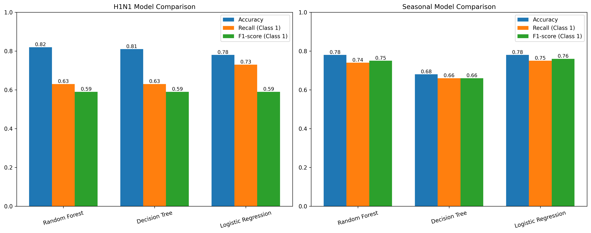

# Determinants and Predictive Modeling of H1N1 and Seasonal Influenza Vaccination Uptake

## Overview

This project investigates the H1N1 and seasonal influenza vaccination uptake. This are done by applying machine learning models, which identifies vaccination distribution, education, percived effectiveness and risk perceptions in relation to vaccine uptake. The insights aim to support data-driven public health interventions to improve vaccination coverage

## Problem Statement

Vaccination rates for H1N1 and seasonal influenza remain inconsistent across populations. Understanding the factors influencing vaccine uptake is critical for designing effective public health strategies and reducing preventable disease spread.

## Business understanding 

This project addresses uneven vaccination uptake by analyzing how vaccination distribution, education, percived effectiveness and risk perceptions as  factors influencing vaccine uptake. The goal is to generate insights to support public health strategies and improve vaccination coverage.

## Data Understanding 

The dataset was obtained from DrivenData and contains survey responses on H1N1 and seasonal influenza vaccination trends, with 26,707 records and 36 features.

## Data Preparation & Splitting

Data preprocessing involved handling missing values, encoding categorical variables, and scaling numerical features. The dataset was split into training and testing sets (80/20), and a pipeline was used to ensure consistent preprocessing and prevent data leakage.

### Stakeholders

These are individuals or organizations that use, influence, or are affected by the public health and healthcare system. In the context of influenza vaccination.

key stakeholders include, Ministry of health, healthcare providers, insurance providers, general public, Non-governmental organizations (NGOs)

## Exploratory Data Analysis

### Vaccine Distribution

Result and insight

Seasonal flu vaccination is more routine while H1N1 was observered as less familiar

### Education vs H1N1 Vaccine Uptake

Individuals with higher education levels demonstrate significantly higher vaccination rates, suggesting that access to information and health literacy play a critical role in vaccine acceptance.

### Perceived Vaccine Effectiveness vs Uptake

Perceived vaccine effectiveness indicating that misinformation or lack of trust in vaccines can significantly reduce vaccination rates.

### Risk Perception vs Vaccine Uptake

Across both H1N1 and seasonal flu, as risk perception and vaccine effectiveness vaccination rates increase.

## Modelling 

Supervised machine learning models were used for binary classification of vaccination uptake. A Random Forest Classifier was used as the primary model due to its ability to capture complex, non-linear relationships in the data.

A Decision Tree Classifier was also implemented as a simpler baseline model for comparison. 

In addition, a Logistic Regression model was introduced as a strong linear benchmark, valued for its interpretability and effectiveness in handling binary classification problems, particularly in cases of class imbalance.

## Evaluation
### Model Performance Comparison

Random Forest generally achieves the highest accuracy (H1N1: 0.82, Seasonal: 0.78), making it strong for overall correct predictions. However, it tends to have lower recall in some cases, meaning it may miss some positive cases.

Logistic Regression provides the best recall performance in both tasks (H1N1: 0.73, Seasonal: 0.75) and also delivers the most balanced performance in the Seasonal Flu task (highest F1-score: 0.76). This makes it more reliable for identifying infected individuals.

Decision Tree consistently performs lower than the other two models, especially in the Seasonal Flu task (accuracy: 0.68), making it the least effective model overall.

## Conclusion

Logistic Regression and Random Forest are the most competitive models, with Logistic Regression showing better balance in detecting positive cases, while Random Forest slightly leads in accuracy for H1N1 prediction. Decision Tree underperforms across both datasets and is not recommended for deployment

## Limitation

High levels of missing values may leading to biased predictions.

Class Imbalance between vaccinated and non-vaccinated individuals can reduce the model effectiveness 

The dataset represents a single point in time and does not capture changes in behavior, perceptions, or policies, limiting the ability to model trends or future shifts.

Misclassification of individuals may lead to ineffective targeting of vaccination campaigns, potentially overlooking vulnerable populations.

## Tools & Technologies
Python, Pandas, NumPy, Scikit-learn, Matplotlib/Seaborn, Jupyter Notebook
   
## Dataset Source
DrivenData H1N1 and Seasonal Vaccination Dataset

## Results 
H1N1 vaccination

Logistic Regression achieves the highest recall (0.73), making it the best at identifying infected cases. Although Random Forest has slightly higher accuracy (0.82), all models share the same F1-score (0.59), indicating limited overall balance. Recall is more critical accuracy.  

Seasonal Flu vaccination

Logistic Regression performs best overall, achieving the highest recall (0.75) and best F1-score (0.76), while also matching Random Forest in accuracy (0.78). This shows a stronger and more balanced performance in detecting cases.

Logistic Regression is the most appropriate model for both H1N1 and Seasonal Flu prediction due to its consistently higher recall and best overall F1-score, despite marginal differences in accuracy