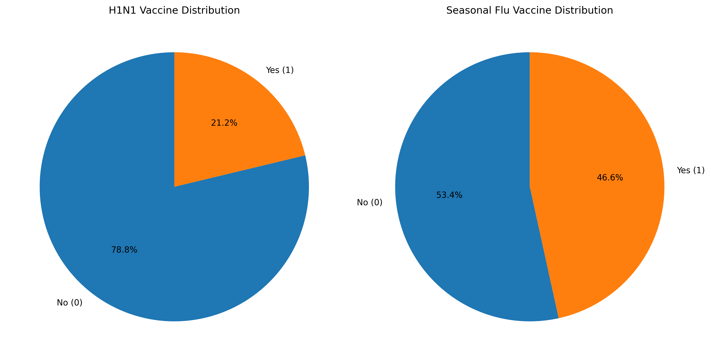
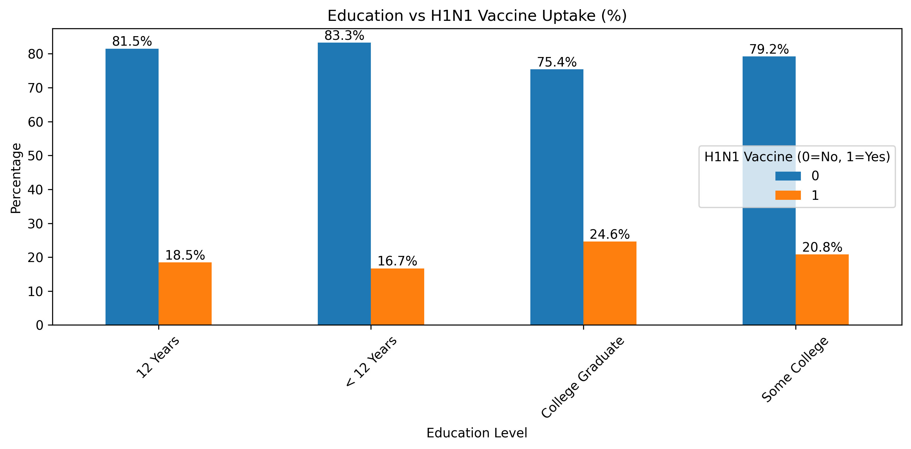
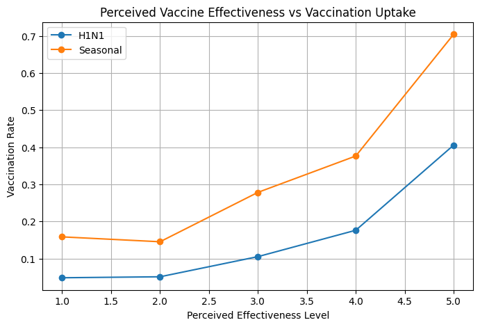
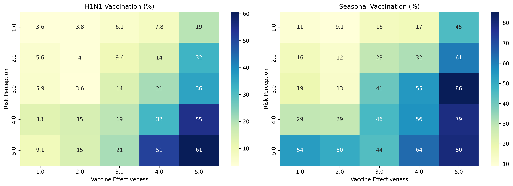
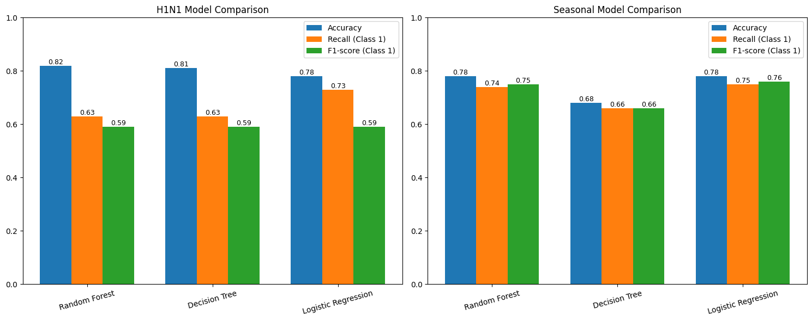

# Determinants and Predictive Modeling of H1N1 and Seasonal Influenza Vaccination Uptake

## Overview

    This project investigates the key drivers of H1N1 and seasonal influenza vaccination uptake using survey data. By applying machine learning models, it identifies how demographic characteristics, behavioral patterns, and risk perceptions influence vaccine acceptance. The insights aim to support data-driven public health interventions to improve vaccination coverage

## Problem Statement
Vaccination rates for H1N1 and seasonal influenza remain inconsistent across populations. Understanding the factors influencing vaccine uptake is critical for designing effective public health strategies and reducing preventable disease spread.

## Business understanding 

    This project addresses uneven vaccination uptake by analyzing how demographic, behavioral, and perception factors influence vaccine decisions. The goal is to generate insights to support public health strategies and improve vaccination coverage.

## Data Understanding 

    The dataset was obtained from DrivenData and contains survey responses on H1N1 and seasonal influenza vaccination behavior, with 26,707 records and 36 features.

## Data Preparation & Splitting

    Data preprocessing involved handling missing values, encoding categorical variables, and scaling numerical features. The dataset was split into training and testing sets (80/20), and a pipeline was used to ensure consistent preprocessing and prevent data leakage.

## Exploratory Data Analysis

### Vaccine Distribution

Result and insight

Seasonal flu vaccination is more routine while H1N1 may be perceived as less familiar & less trusted

### Education vs H1N1 Vaccine Uptake

Individuals with higher education levels demonstrate significantly higher vaccination rates, suggesting that access to information and health literacy play a critical role in vaccine acceptance.

### Perceived Vaccine Effectiveness vs Uptake

Perceived vaccine effectiveness is one of the strongest predictors of uptake, indicating that misinformation or lack of trust in vaccines can significantly reduce vaccination rates.

### Risk Perception vs Vaccine Uptake

Across both H1N1 and seasonal flu, as risk perception and vaccine effectiveness vaccination rates increase.

## Modelling 
### Model Performance Comparison

  Supervised machine learning models were used for binary classification of vaccination uptake. A Random Forest Classifier was used as the primary model due to its ability to capture complex, non-linear relationships in the data. A Decision Tree Classifier was also implemented as a simpler baseline model for comparison. In addition, a Logistic Regression model was introduced as a strong linear benchmark, valued for its interpretability and effectiveness in handling binary classification problems, particularly in cases of class imbalance.

## Evaluation
    Model performance was assessed using standard classification metrics, including accuracy, precision, recall, and F1-score. The Random Forest model demonstrated stronger overall performance compared to the Decision Tree model, achieving approximately 82% accuracy for H1N1 prediction and 78% for seasonal influenza. These results indicate better generalization and more stable predictive performance across both tasks

## Conclusion
    Vaccination uptake is influenced by several key factors, including perceived disease risk, vaccine effectiveness, and education level. Individuals who perceive higher risk and have greater trust in vaccines are more likely to be vaccinated. The machine learning models demonstrate that vaccination behavior can be predicted with reasonable accuracy using demographic and perception-based features, highlighting the relevance of these factors in understanding public health decisions

## Limitation

High levels of missing values may leading to biased predictions.

Class Imbalance between vaccinated and non-vaccinated individuals can reduce the model’s effectiveness 

The dataset represents a single point in time and does not capture changes in behavior, perceptions, or policies, limiting the ability to model trends or future shifts.

Misclassification of individuals may lead to ineffective targeting of vaccination campaigns, potentially overlooking vulnerable populations.

## Tools & Technologies
    Python, Pandas, NumPy, Scikit-learn, Matplotlib/Seaborn, Jupyter Notebook
   
## Dataset Source
    DrivenData H1N1 Vaccination Dataset

## Results 
    Random Forest: ~82% (H1N1), ~78% (Seasonal)
    Decision Tree: Lower performance (~69–81%)
    Key drivers of vaccination uptake: risk perception, vaccine effectiveness, education